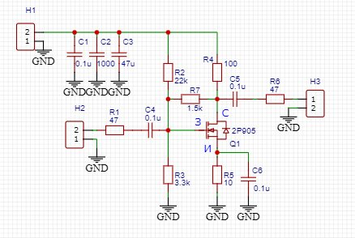

# Si5351 Freq Gen — генератор частот 10 кГц – 220 МГц

Генератор на базе Si5351 и ESP32‑2432S028 с управлением энкодером, тачскрином, пресетами и автосохранением. Проект для PlatformIO (Arduino framework).

## Возможности

- **Диапазон частот:** 10 кГц – 220 МГц (настраивается для трёх каналов CLK0/CLK1/CLK2).
- **Управление:**
  - Энкодер: изменение частоты активного канала.
  - Кнопка энкодера: короткое нажатие — смена шага; долгое нажатие (2 с) — переключение каналов.
  - Тачскрин: выбор пресетов, ввод частоты вручную, управление включением выходов.
- **Пресеты:** до 8 пресетов, каждый хранит состояние 3 каналов (частота и вкл/выкл).
- **Автосохранение:** состояние сохраняется каждые 2 секунды после изменения.
- **Factory Reset:** сброс к заводским настройкам через долгое нажатие кнопки (защита от случайного сброса — предупреждение и таймер).
- **Экран:** вывод трёх частот разными цветами, индикация активного канала и состояния выходов.

## Схема подключения (по коду)

| Модуль | Сигнал | Пин ESP32 | Примечание |
|--------|--------|------------|------------|
| Si5351 | SDA    | 21         | I2C |
| Si5351 | SCL    | 22         | I2C |
| Энкодер| CLK    | 35         | |
| Энкодер| DT     | 27         | |
| Энкодер| SW     | 0          | Кнопка энкодера |
| Тачскрин| CS    | 33         | VSPI |
| Тачскрин| MOSI  | 32         | VSPI |
| Тачскрин| MISO  | 39         | VSPI |
| Тачскрин| CLK   | 25         | VSPI |
| Тачскрин| IRQ   | 36         | Прерывание |

> ⚠️ Важно: пин 0 (GPIO0) используется как кнопка энкодера. Учитывай это при прошивке: на некоторых платах GPIO0 должен быть подтянут к земле для входа в режим загрузки.

## Требования

- Плата: ESP32‑2432S028 (CYD)
- Фреймворк: Arduino (PlatformIO)
- Библиотеки (указать в `platformio.ini`):
  - `Si5351` (например, khoih.prog/Si5351)
  - `TFT_eSPI`
  - `XPT2046_Touchscreen`
  - Встроенная `Preferences` (ESP32)

## Установка и сборка

1. Установите PlatformIO в VS Code.
2. Откройте папку проекта.
3. В `platformio.ini` проверьте целевую плату и скорость загрузки:
   ```ini
   [env:esp32dev]
   platform = espressif32
   board = esp32dev
   framework = arduino
   monitor_speed = 115200
   upload_speed = 921600
pio run
pio run -t upload
Как пользоваться
Основное управление (энкодер)
Вращение энкодера: изменение частоты активного канала (шаг зависит от текущего значения step).
Короткое нажатие кнопки энкодера: смена шага (перебор значений).
Долгое нажатие (≥2 с): переключение активного канала между CLK0 / CLK1 / CLK2.
Тачскрин
Выбор пресетов: переключение между 8 доступными слотами.
Ввод частоты вручную: экранная клавиатура, выбор единиц (Гц/кГц/МГц).
Включение/выключение отдельных каналов (CLK0–CLK2).
Пресеты
Сохранение текущего состояния в выбранный слот.
Загрузка пресета: восстанавливаются частоты и состояние выходов для всех трёх каналов.
Factory Reset
Долгое нажатие кнопки энкодера (≥5 с): появляется предупреждение.
Удержание ≥10 с: полный сброс к заводским установкам (частоты, пресеты, настройки).
Особенности и нюансы
Автосохранение. Состояние сохраняется в энергонезависимую память (Preferences) каждые 2 секунды после любого изменения. Это защищает от потери настроек при внезапном отключении питания.
Пин GPIO0. Используется как кнопка энкодера. При прошивке может потребоваться ручное удержание кнопки BOOT и кратковременное замыкание GPIO0 на землю.
Инициализация Si5351. При старте выполняется калибровка и установка начальных частот. Если частота не устанавливается, проверьте линии I2C (SDA/SCL) и наличие подтяжек.
Белый экран. Если экран остаётся белым, проверьте инициализацию SPI и правильность пинов для тачскрина.
Заводской сброс. Реализована защита от случайного сброса: сначала предупреждение, затем таймер.
Примеры значений по умолчанию (из кода)
Начальные частоты: 10 МГц, 14 МГц, 21 МГц.
Все выходы включены по умолчанию.
Активный канал: CLK0.
Лицензия

Шаг 1. Определим структуру файла
Для инженерного проекта (ВЧ‑усилитель) в README.md лучше выделить:

Название и назначение проекта — кратко, что это за схема.
Схема и компоненты — ссылка на изображение схемы и список ключевых элементов.
Режим работы — основные параметры (ток, напряжение, мощность).
Пошаговая инструкция по сборке и настройке — твои 5 шагов, но в формате, удобном для чтения и копирования.
Меры предосторожности — критично для ВЧ и полевых транзисторов.
Ссылки на документацию — даташиты, стандарты.
Шаг 2. Напишем черновик README.md
Ниже — готовый текст, который можно скопировать в файл README.md. Я адаптировал твои 5 шагов в формат, понятный для Git‑репозитория:

markdown
# ВЧ‑усилитель на 2П905 (КП905В) — 200 МГц

Проект: однокаскадный усилитель на N‑канальном MOSFET для диапазона 200 МГц.  
Транзистор: 2П905 / КП905В, корпус КТ‑16‑2.  
Питание: 12,6 В.  
Целевой ток покоя: 6–8 мА.

## Схема



*Основные компоненты:*
- R2 = 22 кОм, R3 = 3,3 кОм — делитель смещения затвора.
- R7 = 1,5 кОм — ООС сток–затвор (устойчивость).
- R4 = 100 Ом — стоковая нагрузка.
- R5 = 10 Ом — стабилизация тока истока.
- C1–C3 — развязка питания.
- C4–C6 — развязка по ВЧ.

## Режим работы

- Ток покоя $I_D$: 6–8 мА (контроль по падению на R4).
- Напряжение сток–исток $U_{DS}$: ~11,8 В.
- Рассеиваемая мощность $P$: ~83 мВт.
- Крутизна экземпляра: ~24 мА/В (по измерениям).
- Порог $U_{\text{пор}}$: ~1,2 В.

## Инструкция по сборке и настройке

1. **Монтаж транзистора**  
   - Установите 2П905/КП905В строго по цоколёвке, подтверждённой тестером: Pin1 = сток (D), Pin2 = затвор (G), Pin3 = исток (S).  
   - Соблюдайте ориентацию: монтажный винт (обрезанный вывод) — «от себя», выводы — к дорожкам.

2. **Установка резистора обратной связи R7**  
   - Поставьте R7 = 1,5 кОм максимально близко к выводам транзистора (между стоком и затвором).  
   - Не меняйте номинал без необходимости: это залог устойчивости на 200 МГц.

3. **Проверка тока покоя**  
   - После включения измерьте падение напряжения на R4 (100 Ом).  
   - При $I_D = 7$ мА ожидается $U_{R4} = 0,7$ В.  
   - Если ток ниже 5 мА — уменьшите R3 до 2,7–3 кОм.  
   - Если ток выше 10 мА — увеличьте R3 до 3,6–3,9 кОм.

4. **Меры защиты от статики**  
   - При пайке закорачивайте все выводы транзистора проволочкой.  
   - Жало паяльника должно быть заземлено.  
   - Избегайте работы в условиях высокой статики (синтетика, сухой воздух).

5. **Разводка и ВЧ‑требования**  
   - Минимизируйте длину дорожек, особенно от стока и затвора.  
   - R7, C4, C5, C6 ставьте максимально близко к транзистору.  
   - Избегайте петель земли и длинных общих проводников.

## Меры предосторожности

- **Статическое электричество**: КП905В/2П905 чувствительны к ЭСР — всегда заземляйтесь при работе.
- **Питание**: не превышайте $U_{DS} > 60$ В и $I_D > 350$ мА.
- **Температура**: хотя мощность низкая, обеспечьте отвод тепла через монтажный винт.
- **ВЧ‑безопасность**: при тестировании используйте аттенюаторы и согласованные нагрузки.

## Ссылки на документацию

- Даташит КП905В — для параметров $U_{\text{ЗИ max}}$, $S$, $f_{\text{max}}$.  
- Стандарт ГОСТ Р по монтажу ВЧ‑компонентов — для рекомендаций по разводке.  

